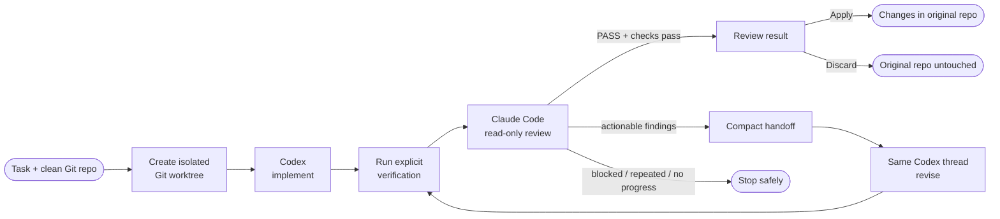

<div align="center">


# Duet

**Codex builds. Claude challenges. Your subscriptions stay local.**

Duet is a local desktop app that lets Codex implement a coding task while Claude
Code independently reviews the result, using the subscriptions already signed in
on your computer.

Duet is a bounded desktop collaboration loop for AI coding tools. Give it one
concrete task in a Git repository: Codex implements the change, Claude Code
independently reviews the working tree, and only evidenced findings go back for
revision. One writer, one reviewer, finite rounds.

[](https://github.com/chriswu727/agent-duet/actions/workflows/ci.yml)
[](https://github.com/chriswu727/agent-duet/security/code-scanning)
[](https://scorecard.dev/viewer/?uri=github.com/chriswu727/agent-duet)
[](#quick-start)
[](./docs/COMPATIBILITY.md)
[](./test)
[](./LICENSE)

[Quick start](#quick-start) · [How it works](#how-it-works) · [Safety model](#safety-model) · [Compatibility](./docs/COMPATIBILITY.md) · [Privacy](./PRIVACY.md) · [Binary release status](./docs/RELEASE_READINESS.md)

</div>

<p align="center">
  
</p>

<p align="center"><sub>The local app detects the official CLI sessions already on your machine. Handoff estimates describe compact prompt size—not account usage or remaining subscription capacity.</sub></p>

---

## Current status

| Surface | Status |
|---|---|
| **Clone and run from source** | Ready on macOS, Windows, and Linux with Node.js 22.12+ and pnpm 10 |
| **Authentication** | Existing ChatGPT and Claude.ai subscription sessions through the official local CLIs; no API keys or API-credit fallback |
| **Automated verification** | 99 offline tests plus packaged UI startup on GitHub-hosted macOS, Windows, and Ubuntu runners |
| **Signed installers** | Not published yet; existing `v0.1.0` assets are [historical unsigned alpha builds](https://github.com/chriswu727/agent-duet/releases) |
| **Real subscription smoke** | Guarded and documented, but intentionally not claimed as run without explicit subscription-use consent |

## Why Duet

Running two coding agents in separate terminals sounds simple until both edit the
same file, paste entire transcripts back and forth, or argue through your usage
limit. Duet makes the roles and stopping conditions structural.

| Ad-hoc two-agent workflow | **Duet** |
|---|---|
| Both agents may write | **Codex is the only writer** |
| Reviewer inherits the implementer's framing | **Claude starts from a fresh review context** |
| Full chat logs get copied between models | **Only the task, diff summary, verification result, and capped findings cross the handoff** |
| "Looks good" can override a broken test | **A failed verification command blocks PASS** |
| The debate can recurse indefinitely | **Stops on pass, blocked review, no progress, repeated findings, cancellation, rounds, or time** |
| API keys often end up in another orchestrator | **Uses the official local CLI logins; API-key overrides are stripped from child environments** |

Duet does not promise that two models make every change correct. It makes the
collaboration inspectable, asymmetric, and finite.

## How it works



1. **Preflight** — confirm both CLIs are installed, subscription-backed sessions
   are active, required MCP and review-isolation options are available, and the
   selected Git working tree is clean.
2. **Isolate and implement** — create a detached managed Git worktree, then launch
   the official Codex stdio MCP server there with workspace-write sandboxing and
   no interactive approvals. The selected repository stays untouched.
3. **Verify** — run the command you supplied, such as `pnpm test`, with an
   ephemeral home and without agent, provider, proxy, or Node injection values.
4. **Challenge** — launch a fresh Claude Code reviewer in plan mode with write,
   delegation, web, plugin, and nested MCP capabilities disabled. Claude Code's
   JSON Schema output is validated again inside Duet before any finding reaches
   Codex.
5. **Revise or stop** — send only valid findings to the same Codex thread. Stop as
   soon as the result passes or a deterministic stop condition fires.
6. **Apply or discard** — inspect the changed-file list, then explicitly apply the
   isolated result or discard it. An exact-state Undo remains available after
   Apply until you edit, stage, or commit newer work.

The compact implementation policy is inspired by
[Ponytail](https://github.com/DietrichGebert/ponytail): understand first, reuse
what exists, prefer the platform and installed dependencies, and make the smallest
correct diff. Duet never minimizes away validation, security, accessibility, or
data-loss protection.

## Quick start

### 1. Install the prerequisites and verify both subscriptions

- Node.js 22.12+
- pnpm 10
- Git
- [Codex CLI](https://developers.openai.com/codex/cli/), signed in with ChatGPT
- [Claude Code](https://code.claude.com/docs/en/quickstart), signed in with Claude.ai

Confirm the same terminal that will start Duet can see both sessions:

```bash
codex login status
claude auth status --json
```

Codex must report a ChatGPT-backed login and Claude Code must report
`"authMethod": "claude.ai"`. API-key and provider-compatible logins are outside
Duet's supported contract. Duet launches these official sessions locally, never
asks for either credential, and does not fall back to API credits. Normal
provider subscription limits still apply.

### 2. Clone and start Duet

```bash
git clone https://github.com/chriswu727/agent-duet.git
cd agent-duet
corepack enable
pnpm install --frozen-lockfile
pnpm start
```

If `corepack` is unavailable, install pnpm 10 with your normal Node.js toolchain
and confirm `pnpm --version` reports major version 10. `pnpm start` opens the
Electron app directly from source; it does not install an unsigned system
package or contact the update channel. Keep the terminal open while Duet runs.

### 3. Run one bounded collaboration

1. Choose a **clean Git repository**. Duet refuses dirty trees to avoid
   overwriting unrelated work.
2. Write one concrete task.
3. Optionally provide a verification command.
4. Choose 1–6 review rounds, a 10–120 minute ceiling, and the Claude reviewer
   model.
5. Start. The run receipt shows phases, structured findings, verification,
   bounded retries, changed files, and the exact reason the loop stopped.
6. Apply or discard the isolated result. Pending runs survive an app restart;
   Duet never copies them into the original repository automatically.

The first-run guide explains these boundaries before any model can be called.
Use **Settings** to save run defaults and choose a local-history limit; Duet
stores the default rounds, time, reviewer model, verification command, and that
limit, but does not remember task text or a repository path in settings. Use
**Inspect diff** on an isolated workspace before deciding to Apply, Discard, or
Undo.

By default, the 100 most recent completed, stopped, blocked, or failed run
receipts are kept in Duet's local app-data folder and can be reopened from
**Local history**. A receipt includes the task, repository path, base commit,
structured findings, check outcomes, error codes, and stop reason. It does not
include either agent's transcript or credentials. Keep 10–100 receipts, disable
future history, delete one, or clear all history from the app. See
[PRIVACY.md](./PRIVACY.md) for every local data category and deletion path.

The default is 3 rounds and 60 minutes. These are per-run safety stops—not token
quotas and not a statement about your remaining subscription capacity.

## Troubleshooting

| Symptom | Check |
|---|---|
| Duet cannot find `codex` or `claude` | Run `codex --version` and `claude --version` in the same terminal before `pnpm start`. Restart the terminal after installing a CLI. On Windows, also check `where codex` and `where claude`; on macOS/Linux, use `command -v codex` and `command -v claude`. |
| A CLI is installed but authentication is rejected | Re-run the two status commands above. Duet accepts the supported ChatGPT and Claude.ai subscription login types, not API-key or third-party provider sessions. |
| A repository is rejected before the run | Run `git status --short` in that repository. Commit, stash, or deliberately remove every tracked and untracked change before selecting it again. |
| Claude says PASS but the run does not complete | The verification command failed or the review envelope was invalid. Machine checks always override a model verdict; run the same verification command manually to inspect its output. |
| Apply or Undo is refused | The original repository changed after Duet captured its exact state. Inspect the pending diff and keep or discard it deliberately; Duet will not force an unsafe overwrite. |
| Source startup fails after an update | Confirm `node --version` is 22.12 or newer, `pnpm --version` is 10.x, then rerun `pnpm install --frozen-lockfile` and `pnpm start`. |

For supported versions and redacted diagnostic guidance, see
[Compatibility](./docs/COMPATIBILITY.md) and [Support](./SUPPORT.md). Never post
credentials, private source, identifying local paths, or raw agent transcripts.

## FAQ

### Does Duet use API credits?

No. Duet supports the official Codex CLI logged in through ChatGPT and Claude
Code logged in through Claude.ai. Provider API-key variables are stripped from
agent child processes. Calls still count against the rules and limits of the
user's own subscriptions.

### Does Duet edit my selected repository immediately?

No. Work happens in a managed isolated Git worktree. The original repository
changes only after an explicit Apply, and Apply fails closed if the original
state changed in the meantime.

### Do more rounds mean more subscription capacity?

No. Rounds and minutes are per-run safety ceilings. They neither measure nor
predict remaining account capacity, and the loop stops early on pass, repeated
findings, no progress, cancellation, timeout, or a blocked review.

### Is source-ready the same as a signed binary release?

No. Cloning and running the source is the supported evaluation path today.
Signed and notarized installers remain behind the external gates in
[Release readiness](./docs/RELEASE_READINESS.md); the historical unsigned alpha
assets are not presented as production-ready downloads.

## Safety model

| Boundary | Enforcement |
|---|---|
| **Single writer** | Only Codex receives workspace-write access. Claude runs in plan mode. |
| **Clean-tree gate** | A run refuses to start if Git already has tracked or untracked changes. |
| **Isolated writes** | Codex and verification run in a managed detached worktree; the selected repository changes only after an explicit Apply. |
| **Guarded Apply** | Apply requires the original repository to remain clean and at the exact base commit. |
| **Read-only diff preview** | The Apply/Undo decision includes a capped, no-color unified diff built from exact Git trees, including formerly untracked files. The complete tree—not the capped display—is transferred on Apply. |
| **Exact-state Undo** | Undo runs only while the repository fingerprint exactly matches Duet's applied result; newer edits fail closed. |
| **Crash recovery** | Active and mid-Apply manifests are persisted. Restart recovery applies only an exact content fingerprint and locks mismatches for manual inspection. |
| **Credential isolation** | Child environments use an allowlist; OpenAI, Anthropic, and other provider API-key variables are omitted. |
| **Verification isolation** | Verification gets an ephemeral home/cache/config tree and no agent, provider, proxy, or Node injection variables. It still runs with the local user's OS permissions and is not claimed as a security sandbox. |
| **No nested agent loop** | Codex MCP servers are cleared; Claude plugins, skills, nested MCP, web access, delegation, and write tools are disabled. |
| **Fail-closed review** | Claude Code produces JSON Schema-constrained output; Duet validates field types and verdict invariants again. Missing, malformed, or contradictory reviews become `BLOCKED`, never PASS. |
| **Machine check wins** | Claude cannot PASS a non-zero verification result. |
| **Progress detection** | Duet hashes tracked diffs and untracked contents; an unchanged revision stops the loop. |
| **Bounded output** | Agent output and cross-agent findings are capped before display or handoff. |
| **Bounded retry** | Only an explicitly transient Claude read-only review may retry, once. Codex write calls, timeouts, protocol failures, and permanent failures are never replayed automatically. |
| **Stable errors** | Failures carry a durable code, category, phase, and retryability flag for diagnosis without exposing child-process causes. |
| **Private preferences** | Settings are schema-validated, atomically replaced, and stored with private file permissions. Invalid settings are quarantined and safe defaults are restored. |
| **Versioned history** | Receipt v2 records evidence without model transcripts. The configurable newest 10–100 are written atomically with private local permissions; history can also be disabled or deleted in-app. |
| **Process cleanup** | Cancel and timeout terminate Unix process groups or Windows process trees, with a forced cleanup fallback. |
| **Desktop hardening** | Electron uses context isolation, renderer sandboxing, an exact-origin/top-frame IPC gate, a narrow preload bridge, CSP, denied permissions, blocked navigation, ASAR integrity, and explicit production fuses. |

Duet is designed for **personal, local use**. It is not a hosted credential proxy,
does not implement ChatGPT or Claude.ai OAuth, and should not be turned into a
multi-user service that routes subscription credentials.

### Why Claude is not called through MCP today

Codex runs through its official `codex mcp-server`. Claude Code documents
`claude mcp serve`, but the tested Claude Code 2.1.208 surface advertised an
`Agent` tool without registering a usable agent type for an external MCP client.
Duet therefore uses Claude Code's official non-interactive local mode for the
reviewer. The isolation policy is explicit and the adapter is small, so this can
move back to MCP when the external agent contract is reliable.

## Development and verification

The Quick Start above is sufficient for normal local use. Contributors can run
the complete offline and package checks from the cloned repository:

```bash
pnpm check
pnpm test
pnpm run pack
pnpm run verify:package-security
pnpm run smoke:package
```

These checks never call either model. They use fake Codex, Claude, and MCP
executables to exercise stdio, Windows command shims, CLI capability detection,
verification shells, and process-tree cleanup. A real end-to-end smoke is
intentionally separate and refuses to start unless both consent values are present:

```bash
DUET_LIVE_SMOKE=1 \
DUET_LIVE_SMOKE_CONFIRM=I_ACCEPT_SUBSCRIPTION_USAGE \
pnpm smoke:live
```

That command creates a disposable Git repository and invokes both local
subscription sessions once. It is not part of CI or the default test suite.

Build an installer for the current platform:

```bash
pnpm run dist
```

`verify:package-security` reads the packaged binary and fails unless `app.asar`
exists and all eight supported Electron fuses match the repository policy.
`smoke:package` launches that binary through Electron's embedded Chromium and
checks onboarding, settings persistence, the update bridge, blocked navigation,
and renderer errors without downloading a browser or calling either model.

The manual **Release** workflow builds a signed, notarized, attested candidate
for all three platforms without publishing it. Pushing an exact
`v<package-version>` tag repeats that matrix but fails closed unless the written
distribution confirmation, exact-version live smoke, external beta, and signing
gates are all recorded. It launches every packaged UI, generates a
packaged-runtime SPDX SBOM, creates GitHub build attestations, and publishes
sorted SHA-256 checksums only after every gate passes. Local builds are unsigned
unless you provide platform signing credentials; no certificate or secret lives
in this repository. See [Release readiness](./docs/RELEASE_READINESS.md),
[Beta testing](./docs/BETA_TESTING.md), and
[Maintainer release instructions](./docs/RELEASING.md).

## Project layout

```text
agent-duet/
├── src/main.mjs            # hardened Electron main process and run lifecycle
├── src/preload.cjs         # narrow renderer IPC bridge
├── src/renderer/           # desktop UI and run receipt
├── src/core/
│   ├── orchestrator.mjs    # finite Codex → verify → Claude → revise state machine
│   ├── mcp.mjs             # stdio MCP client for Codex
│   ├── stdio-transport.mjs # cross-platform MCP lifecycle and process-tree cleanup
│   ├── claude.mjs          # isolated subscription-backed Claude reviewer
│   ├── review.mjs          # JSON Schema, semantic validation, and finding rendering
│   ├── errors.mjs          # stable taxonomy and bounded read-only retry helper
│   ├── git.mjs             # clean-tree gate and progress snapshots
│   ├── workspace.mjs       # managed worktrees, Apply/Discard, Undo, and recovery
│   ├── history.mjs         # private atomic receipt storage and retention
│   ├── settings.mjs        # schema-validated local defaults and recovery
│   ├── security.mjs        # exact renderer origin and top-frame trust checks
│   ├── prompts.mjs         # lean implementation and fail-closed review contract
│   ├── receipt.mjs         # transcript-free, versioned run evidence
│   ├── process.mjs         # subscription CLI environment and child-process cleanup
│   └── verify.mjs          # ephemeral verification environment and native shell
├── test/                   # offline unit and temporary-Git integration tests
└── .github/workflows/      # CI and cross-platform release builds
```

## Verification status

- 99 offline tests cover configuration ceilings, agent and verification
  environment scrubbing, exact renderer-origin checks, Electron fuse policy, CLI
  discovery and compatibility, real fake-CLI/MCP subprocess contracts, native
  verification shells, process-tree cleanup, isolated-worktree Apply/Discard,
  exact-state Undo, interrupted-Apply recovery, Claude isolation, structured
  reviewer invariants, retry boundaries, untracked-file progress hashing,
  configurable and deletable private receipt history, settings migration and
  recovery, capped exact-tree diff previews,
  renderer labelling and injection guards, Receipt v2, update state transitions,
  candidate/publication separation, release preflight, checksums, and the
  complete orchestrator state machine including classified failures.
- The guarded live smoke exists for explicit manual use and was not run while
  developing this release, so no subscription usage is claimed here.
- The current v0.1.1 source packages successfully as universal `x86_64`/`arm64`
  macOS DMG, ZIP, and `.app` artifacts. Their architectures, archives, update
  feed, ASAR, all eight configured fuses, ad-hoc signature, hardened startup,
  settings persistence, onboarding lock, navigation block, update bridge, and
  renderer console were verified locally against freshly packaged output. The
  extracted packaged runtime also produced and passed validation as a 110-package
  SPDX 2.3 SBOM.
- The published v0.1.0 macOS arm64 app was launched and its renderer verified;
  its DMG and ZIP also passed `hdiutil verify` and `unzip -t` locally.
- Windows and Linux unpacked packages also launch and pass package-security and
  UI smoke checks on GitHub-hosted runners. Production Apple/Windows signing,
  notarization, release attestations, real subscription smoke, external install
  testing, and gated publication have not run because their documented external
  credentials or approvals are absent.

## Roadmap

- Complete the externally gated signed `v0.1.1` beta and publish it only after
  every release-readiness item passes.
- A completed-run export suitable for issues and pull requests.
- Optional Claude-writer / Codex-reviewer role reversal after write isolation is
  independently verified.
- Native Claude MCP reviewing when its external agent contract is usable.
- More deterministic checks before a model review, reducing unnecessary usage.

## Contributing

Issues and focused pull requests are welcome. Please keep the invariant intact:
one writer, an independent read-only reviewer, and deterministic stopping
conditions. Security reports should follow [SECURITY.md](./SECURITY.md).
Local-data behavior is documented in [PRIVACY.md](./PRIVACY.md). See
[CONTRIBUTING.md](./CONTRIBUTING.md) for the development and verification
contract, [SUPPORT.md](./SUPPORT.md) for help channels, and
[CHANGELOG.md](./CHANGELOG.md) for user-visible changes. Signed candidate results
follow [docs/BETA_TESTING.md](./docs/BETA_TESTING.md).

## License

[MIT](./LICENSE) © Yichen Wu.

---

<div align="center">

Built for developers who want a second model's skepticism without an unbounded model debate.

</div>
