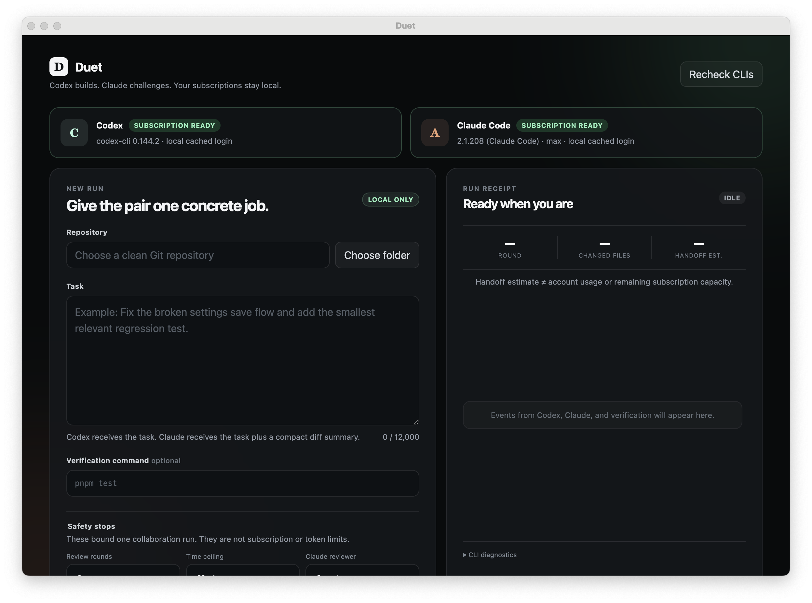

<div align="center">


# Duet

**Codex builds. Claude challenges. Your subscriptions stay local.**

Duet is a bounded desktop collaboration loop for AI coding tools. Give it one
concrete task in a Git repository: Codex implements the change, Claude Code
independently reviews the working tree, and only evidenced findings go back for
revision. One writer, one reviewer, finite rounds.

[](https://github.com/chriswu727/agent-duet/actions/workflows/ci.yml)
[](https://github.com/chriswu727/agent-duet/releases/latest)
[](https://github.com/chriswu727/agent-duet/releases/latest)
[](./test)
[](./LICENSE)

[Download](https://github.com/chriswu727/agent-duet/releases/latest) · [How it works](#how-it-works) · [Safety model](#safety-model) · [Build from source](#build-from-source)

</div>

<p align="center">
  
</p>

<p align="center"><sub>The local app detects the official CLI sessions already on your machine. Handoff estimates describe compact prompt size—not account usage or remaining subscription capacity.</sub></p>

---

## Why Duet

Running two coding agents in separate terminals sounds simple until both edit the
same file, paste entire transcripts back and forth, or argue through your usage
limit. Duet makes the roles and stopping conditions structural.

| Ad-hoc two-agent workflow | **Duet** |
|---|---|
| Both agents may write | **Codex is the only writer** |
| Reviewer inherits the implementer's framing | **Claude starts from a fresh review context** |
| Full chat logs get copied between models | **Only the task, diff summary, verification result, and capped findings cross the handoff** |
| "Looks good" can override a broken test | **A failed verification command blocks PASS** |
| The debate can recurse indefinitely | **Stops on pass, blocked review, no progress, repeated findings, cancellation, rounds, or time** |
| API keys often end up in another orchestrator | **Uses the official local CLI logins; API-key overrides are stripped from child environments** |

Duet does not promise that two models make every change correct. It makes the
collaboration inspectable, asymmetric, and finite.

## How it works


1. **Preflight** — confirm both CLIs are installed, subscription-backed sessions
   are active, required MCP and review-isolation options are available, and the
   selected Git working tree is clean.
2. **Isolate and implement** — create a detached managed Git worktree, then launch
   the official Codex stdio MCP server there with workspace-write sandboxing and
   no interactive approvals. The selected repository stays untouched.
3. **Verify** — run the command you supplied, such as `pnpm test`.
4. **Challenge** — launch a fresh Claude Code reviewer in plan mode with write,
   delegation, web, plugin, and nested MCP capabilities disabled. Claude Code's
   JSON Schema output is validated again inside Duet before any finding reaches
   Codex.
5. **Revise or stop** — send only valid findings to the same Codex thread. Stop as
   soon as the result passes or a deterministic stop condition fires.
6. **Apply or discard** — inspect the changed-file list, then explicitly apply the
   isolated result or discard it. An exact-state Undo remains available after
   Apply until you edit, stage, or commit newer work.

The compact implementation policy is inspired by
[Ponytail](https://github.com/DietrichGebert/ponytail): understand first, reuse
what exists, prefer the platform and installed dependencies, and make the smallest
correct diff. Duet never minimizes away validation, security, accessibility, or
data-loss protection.

## Quick start

### 1. Install and sign in to the official CLIs

- [Codex CLI](https://developers.openai.com/codex/cli/) — sign in with ChatGPT.
- [Claude Code](https://code.claude.com/docs/en/quickstart) — sign in with Claude.ai.
- Install Git.

Duet never asks for either credential. It only checks the login status reported by
each CLI and launches those binaries locally.

### 2. Download Duet

Get the build for your platform from
[GitHub Releases](https://github.com/chriswu727/agent-duet/releases/latest).

Public macOS builds are unsigned until the project has Apple Developer ID signing
and notarization configured. If macOS blocks a build, either build it from source
or review the release checksum and use the system's **Open Anyway** flow only if
you trust this repository.

### 3. Run one bounded collaboration

1. Choose a **clean Git repository**. Duet refuses dirty trees to avoid
   overwriting unrelated work.
2. Write one concrete task.
3. Optionally provide a verification command.
4. Choose 1–6 review rounds, a 10–120 minute ceiling, and the Claude reviewer
   model.
5. Start. The run receipt shows phases, structured findings, verification,
   bounded retries, changed files, and the exact reason the loop stopped.
6. Apply or discard the isolated result. Pending runs survive an app restart;
   Duet never copies them into the original repository automatically.

The first-run guide explains these boundaries before any model can be called.
Use **Settings** to save run defaults; Duet stores the default rounds, time,
reviewer model, and verification command, but does not remember task text or a
repository path. Use **Inspect diff** on an isolated workspace before deciding to
Apply, Discard, or Undo.

The 100 most recent completed, stopped, blocked, or failed run receipts are kept
in Duet's local app-data folder and can be reopened from **Local history**. A
receipt includes the task, repository path, base commit, structured findings,
check outcomes, error codes, and stop reason. It does not include either agent's
transcript or credentials.

The default is 3 rounds and 60 minutes. These are per-run safety stops—not token
quotas and not a statement about your remaining subscription capacity.

## Safety model

| Boundary | Enforcement |
|---|---|
| **Single writer** | Only Codex receives workspace-write access. Claude runs in plan mode. |
| **Clean-tree gate** | A run refuses to start if Git already has tracked or untracked changes. |
| **Isolated writes** | Codex and verification run in a managed detached worktree; the selected repository changes only after an explicit Apply. |
| **Guarded Apply** | Apply requires the original repository to remain clean and at the exact base commit. |
| **Read-only diff preview** | The Apply/Undo decision includes a capped, no-color unified diff built from exact Git trees, including formerly untracked files. The complete tree—not the capped display—is transferred on Apply. |
| **Exact-state Undo** | Undo runs only while the repository fingerprint exactly matches Duet's applied result; newer edits fail closed. |
| **Crash recovery** | Active and mid-Apply manifests are persisted. Restart recovery applies only an exact content fingerprint and locks mismatches for manual inspection. |
| **Credential isolation** | Child environments use an allowlist; OpenAI, Anthropic, and other provider API-key variables are omitted. |
| **No nested agent loop** | Codex MCP servers are cleared; Claude plugins, skills, nested MCP, web access, delegation, and write tools are disabled. |
| **Fail-closed review** | Claude Code produces JSON Schema-constrained output; Duet validates field types and verdict invariants again. Missing, malformed, or contradictory reviews become `BLOCKED`, never PASS. |
| **Machine check wins** | Claude cannot PASS a non-zero verification result. |
| **Progress detection** | Duet hashes tracked diffs and untracked contents; an unchanged revision stops the loop. |
| **Bounded output** | Agent output and cross-agent findings are capped before display or handoff. |
| **Bounded retry** | Only an explicitly transient Claude read-only review may retry, once. Codex write calls, timeouts, protocol failures, and permanent failures are never replayed automatically. |
| **Stable errors** | Failures carry a durable code, category, phase, and retryability flag for diagnosis without exposing child-process causes. |
| **Private preferences** | Settings are schema-validated, atomically replaced, and stored with private file permissions. Invalid settings are quarantined and safe defaults are restored. |
| **Versioned history** | Receipt v2 records the base commit, structured findings, diff hashes, check outcomes, retries, errors, and stable stop reason without storing agent transcripts. The newest 100 are written atomically with private local permissions. |
| **Process cleanup** | Cancel and timeout terminate Unix process groups or Windows process trees, with a forced cleanup fallback. |
| **Desktop hardening** | Electron uses context isolation, renderer sandboxing, a narrow preload bridge, CSP, denied permissions, and blocked navigation. |

Duet is designed for **personal, local use**. It is not a hosted credential proxy,
does not implement ChatGPT or Claude.ai OAuth, and should not be turned into a
multi-user service that routes subscription credentials.

### Why Claude is not called through MCP today

Codex runs through its official `codex mcp-server`. Claude Code documents
`claude mcp serve`, but the tested Claude Code 2.1.208 surface advertised an
`Agent` tool without registering a usable agent type for an external MCP client.
Duet therefore uses Claude Code's official non-interactive local mode for the
reviewer. The isolation policy is explicit and the adapter is small, so this can
move back to MCP when the external agent contract is reliable.

## Build from source

Requirements: Node.js 22+, pnpm 10+, Git, Codex CLI, and Claude Code.

```bash
git clone https://github.com/chriswu727/agent-duet.git
cd agent-duet
pnpm install
pnpm start
```

Run the offline checks:

```bash
pnpm check
pnpm test
```

These checks never call either model. They use fake Codex, Claude, and MCP
executables to exercise stdio, Windows command shims, CLI capability detection,
verification shells, and process-tree cleanup. A real end-to-end smoke is
intentionally separate and refuses to start unless both consent values are present:

```bash
DUET_LIVE_SMOKE=1 \
DUET_LIVE_SMOKE_CONFIRM=I_ACCEPT_SUBSCRIPTION_USAGE \
pnpm smoke:live
```

That command creates a disposable Git repository and invokes both local
subscription sessions once. It is not part of CI or the default test suite.

Build an installer for the current platform:

```bash
pnpm run dist
```

Pushing a `v*` tag runs the release workflow and attaches macOS, Windows, and
Linux artifacts to a GitHub Release. Local builds are unsigned unless you provide
the platform's signing credentials; no certificates or signing secrets live in
this repository.

## Project layout

```text
agent-duet/
├── src/main.mjs            # hardened Electron main process and run lifecycle
├── src/preload.cjs         # narrow renderer IPC bridge
├── src/renderer/           # desktop UI and run receipt
├── src/core/
│   ├── orchestrator.mjs    # finite Codex → verify → Claude → revise state machine
│   ├── mcp.mjs             # stdio MCP client for Codex
│   ├── stdio-transport.mjs # cross-platform MCP lifecycle and process-tree cleanup
│   ├── claude.mjs          # isolated subscription-backed Claude reviewer
│   ├── review.mjs          # JSON Schema, semantic validation, and finding rendering
│   ├── errors.mjs          # stable taxonomy and bounded read-only retry helper
│   ├── git.mjs             # clean-tree gate and progress snapshots
│   ├── workspace.mjs       # managed worktrees, Apply/Discard, Undo, and recovery
│   ├── history.mjs         # private atomic receipt storage and retention
│   ├── settings.mjs        # schema-validated local defaults and recovery
│   ├── prompts.mjs         # lean implementation and fail-closed review contract
│   ├── receipt.mjs         # transcript-free, versioned run evidence
│   └── process.mjs         # credential allowlist and child-process cleanup
├── test/                   # offline unit and temporary-Git integration tests
└── .github/workflows/      # CI and cross-platform release builds
```

## Verification status

- 72 offline tests cover configuration ceilings, environment scrubbing, CLI
  discovery and compatibility, real fake-CLI/MCP subprocess contracts, native
  verification shells, process-tree cleanup, isolated-worktree Apply/Discard,
  exact-state Undo, interrupted-Apply recovery, Claude isolation, structured
  reviewer invariants, retry boundaries, untracked-file progress hashing,
  private receipt history, settings recovery, capped exact-tree diff previews,
  renderer labelling and injection guards, Receipt v2, and the complete
  orchestrator state machine including classified failures.
- The guarded live smoke exists for explicit manual use and was not run while
  developing this release, so no subscription usage is claimed here.
- The current v0.1.1 source packages successfully as a macOS arm64 `.app`.
- The published v0.1.0 macOS arm64 app was launched and its renderer verified;
  its DMG and ZIP also passed `hdiutil verify` and `unzip -t` locally.
- Windows, Linux, macOS x64, signing, and notarization rely on GitHub runners or
  platform credentials and are not claimed as locally verified.

## Roadmap

- Signed and notarized macOS releases.
- A completed-run export suitable for issues and pull requests.
- Optional Claude-writer / Codex-reviewer role reversal after write isolation is
  independently verified.
- Native Claude MCP reviewing when its external agent contract is usable.
- More deterministic checks before a model review, reducing unnecessary usage.

## Contributing

Issues and focused pull requests are welcome. Please keep the invariant intact:
one writer, an independent read-only reviewer, and deterministic stopping
conditions. Security reports should follow [SECURITY.md](./SECURITY.md).

## License

[MIT](./LICENSE) © Yichen Wu.

---

<div align="center">

Built for developers who want a second model's skepticism without an unbounded model debate.

</div>
